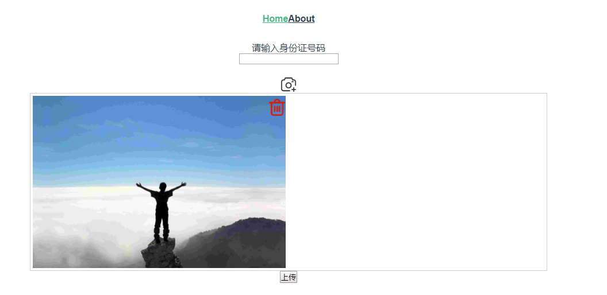

# vue-upload

## Project setup
```
npm install
```

### Compiles and hot-reloads for development
```
npm run serve
```

### Compiles and minifies for production
```
npm run build
```

### Run your tests
```
npm run test
```

### Lints and fixes files
```
npm run lint
```
### run dist
```
npm install -g serve
serve -s dist

```
### 介绍

1.主要使用了vue cli3 实现拍照上传功能；
2.拍照后使用Exif.js插件对照片进行旋转、压缩；
3.效果图如下：


